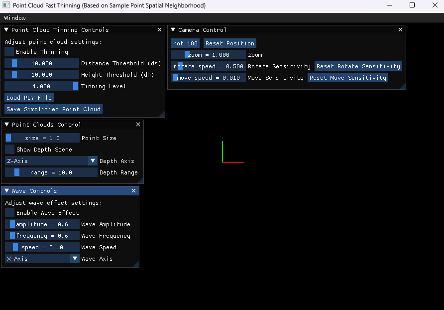

# PointCloudsFastTinning



This project implements a fast point cloud thinning algorithm based on sample point spatial neighborhood and provides a graphical user interface (GUI) to load, display, and manipulate point cloud data.

## Features

- Load PLY format point cloud data
- Display and rotate point cloud
- Adjust parameters of the point cloud thinning algorithm
- Save the thinned point cloud data

## Dependencies

- Python 3.x
- Open3D
- NumPy
- ImGui
- GLFW
- PyOpenGL
- Tkinter
- Pandas

## Installation

1. Clone this repository to your local machine:

   ```sh
   git clone https://github.com/Henrik-JIA/PointCloudsFastTinning.git
   cd PointCloudsFastTinning
   ```

2. Install the required Python libraries:

   ```sh
   pip install open3d numpy imgui glfw PyOpenGL pandas
   ```

## Usage

1. Run the main program:

   ```sh
   python main.py
   ```

2. In the GUI, you can:

   - Click the "Load PLY File" button to load point cloud data.
   - Check the "Enable Thinning" checkbox to enable the point cloud thinning algorithm.
   - Use the sliders to adjust the distance threshold (ds), height threshold (dh), and LOD level.
   - Click the "Save Simplified Point Cloud" button to save the thinned point cloud data.

## File Descriptions

- `main.py`: The main program, containing the GUI and point cloud rendering logic.
- `function` folder: Contains the implementation of the point cloud thinning algorithm.
  - `point_cloud_thinning.py`: Implementation of the point cloud thinning algorithm.
- `interface` folder: Contains various control interfaces.
  - `camera_control_interface.py`: Camera control interface.
  - `point_clouds_control_interface.py`: Point clouds control interface.
  - `point_clouds_tinning_control_interface.py`: Point clouds thinning control interface.
  - `wave_control_interface.py`: Wave control interface.
- `util` folder: Contains utility classes.
  - `mouse_controller.py`: MouseController class, used to handle mouse input.
- `imgui.ini`: ImGui configuration file.

## Example

- A Point Clouds Fast Thinning Algorithm Based on Sample Point Spatial Neighborhood
  

## Reference Algorithm

- Wei J, Xu M, Xiu H. A point clouds fast thinning algorithm based on sample point spatial neighborhood[J]. Journal of Information Processing Systems, 2020, 16(3): 688-698.

## License

This project is licensed under the MIT License. For more information, see the `LICENSE` file.